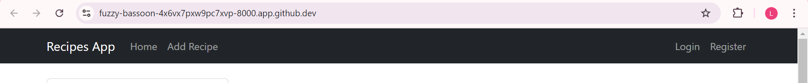
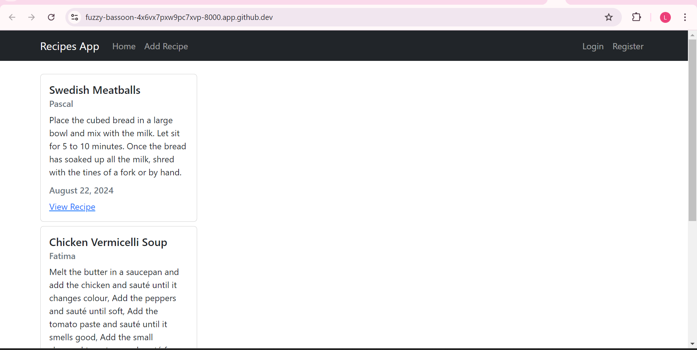
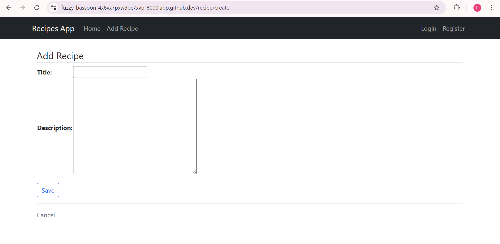
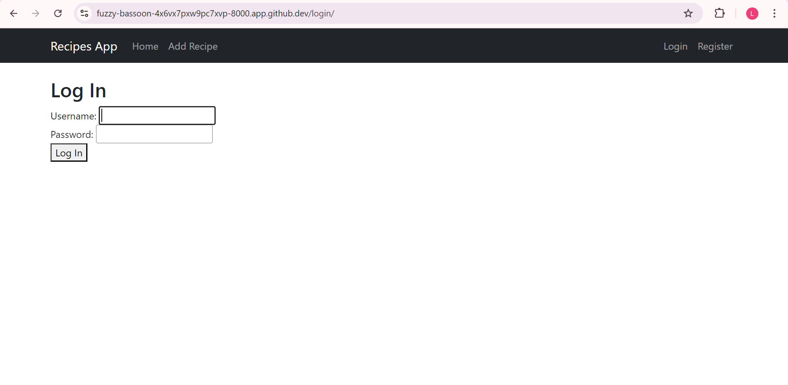
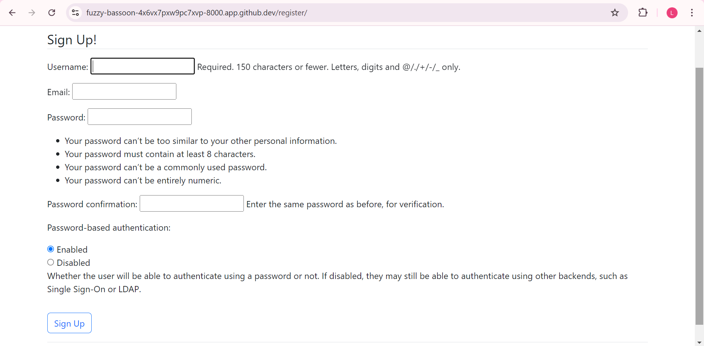
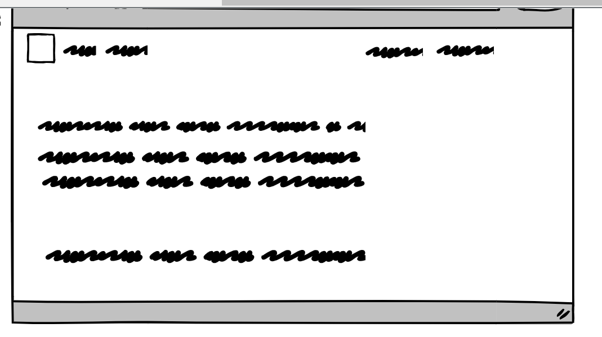
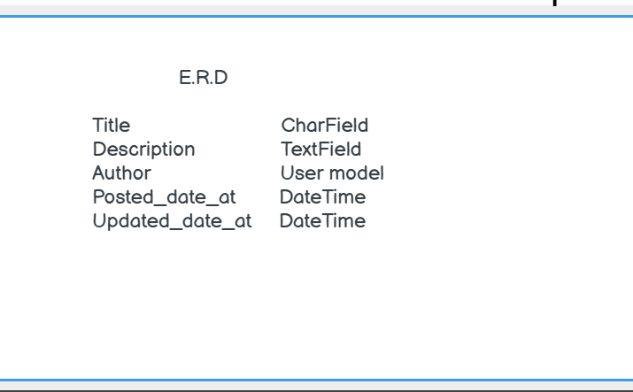

# Recipe Sharing App
This app is made for food lovers and people who are into sharing their favourite and awesome recipes.
It allows users to register, sign in and share their recipes and users can also update, delete their recipes if needed. 

## Existing Features
#### <li> Navigation Bar </li>

The website features four navigation Links: a Home page, a Add a recipe page, a Login page and a Register page.  
Each navigation link  allows the visitor to browse effortlessly on the website and access all the pages without complications. 

#### <li> The Home page </li>

The home page gives the user a variety of awesome recipes that is posted by other users.

#### <li> The Add a recipe page </li>

The add a recipe page contains a form of title and a description field with a save button underneath to have users recipes save in the app.

#### <li> The Login page </li>

The login page contains a login form where users can sign in with their registered user name and password.

#### <li> The Register page </li>

The register page allows the users to be able to create a user name, insert their email and use a trusted password to be able to sign in the app and share their recipes. 

# Future ideas
<li>Users can like, comment on posted recipes by other users</li>

# Testing
I have tested all the forms and views into automated testing in Django and it returns a positive validation.

# Deployment
The site was deployed to GitHub pages. The steps to deploy are as follows:
1. In the GitHub repository, navigate to the Settings tab
From the source section drop-down menu, select the Master Branch
Once the master branch has been selected, the page will be automatically refreshed with a detailed ribbon display to indicate the successful deployment.

# Credits
### Content
This youtube video helps me with the project [Youtube](https://www.youtube.com/watch?v=djbQ8zE2VlQ)

## Resource Links used in the project

* https://cdnjs.com/libraries/bootstrap - CDN for bootstrap links
* https://getbootstrap.com/docs/5.2/getting-started/introduction - Bootstrap documentation

## Wireframe and E.R.D Diagramm

